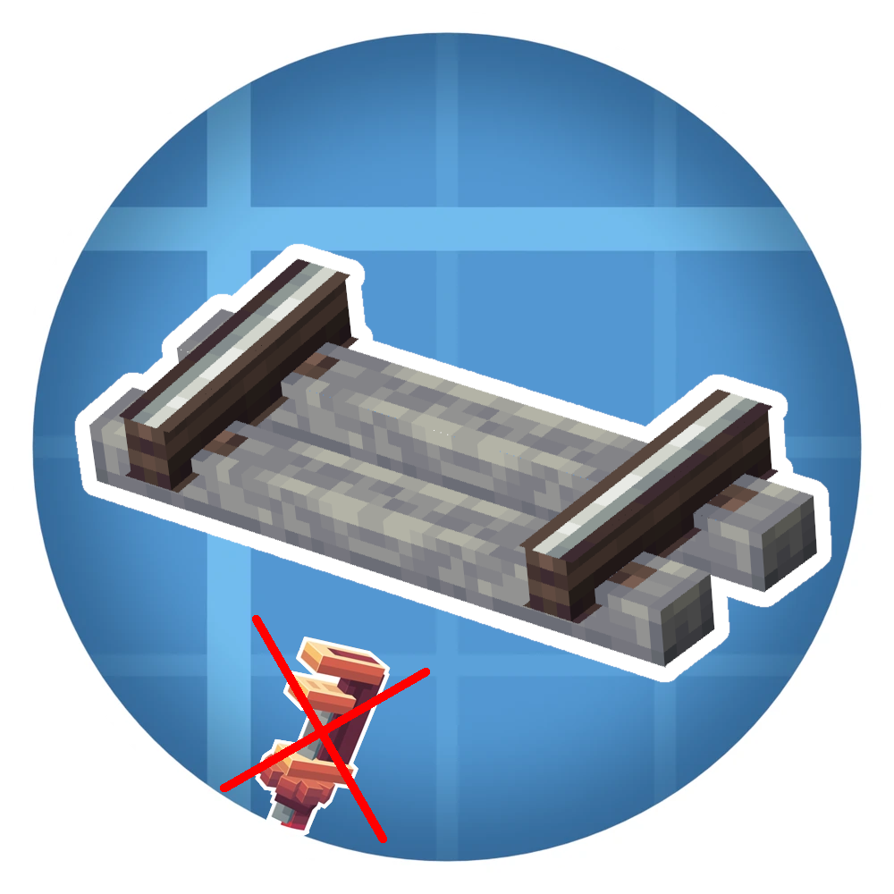

<h1 align="center">Create Trains</h1>

> For your *vanilla+* experience with trains.

> [!NOTE]
> This is a fork of the original [Create](https://github.com/Creators-of-Create/Create) mod stripped of everything but **trains** and related features.

> [!WARNING]
> HERE BE DRAGONS! **Support and compatibility of this mod is** ***MINIMAL***!
> You should prefer using the original [Create](https://github.com/Creators-of-Create/Create) mod!
> **DO NOT** report issues with this mod to the original author!

## Features

- Trains, Tracks, Signals, etc.
- Nixie Tubes, Displays and Display Link (no rotational force needed)
- Copycat blocks
- All other machines and blocks are inaccessible\*
- Custom recipes (for [supported addons](#supported-addons) too!) to bypass the need for the disabled items
<!-- - Nearly 2 MB smaller jar! *WOW!* -->

\* All items and blocks are still defined in the code for compatibility.

## Supported Addons
These Create addons were tested to work with this fork (though there still may be issues):

- [Create: Bells & Whistles](https://modrinth.com/mod/bellsandwhistles) (ver. `0.4.3-1.20.x`)
- [Create: Steam 'n' Rails](https://modrinth.com/mod/create-steam-n-rails) (ver. `1.6.11-alpha+forge-mc1.20.1`)
- [Create: Contraption Terminals](https://modrinth.com/mod/create-contraption-terminals) (ver. `1.20`)
- [Create: Copycats+](https://modrinth.com/mod/copycats) (ver. `3.0.2+mc.1.20.1-forge`)

<!-- ## :warning: Incompatible Addons
These Create addons/combinations were tested to NOT work with this fork:

- [Create: Steam 'n' Rails](https://modrinth.com/mod/create-steam-n-rails) (ver. `1.6.11-alpha+forge-mc1.20.1`) together with [BCLib](https://modrinth.com/mod/bclib) (ver. `3.0.14`) (dependency of Better End/Nether/...)
    - Either mod is compatible with this fork, but not both at the same time -->

## Building

For datagen run `DATAGEN="true" ./gradlew runData`, Steam 'n' Rails needs the env.
